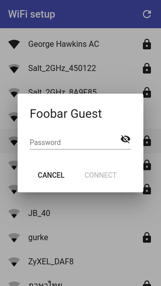

MicroPython lighthouse controls
===============================

This project was created with [MicroPython](https://micropython.org/) running on an [ESP32](https://docs.espressif.com/projects/esp-idf/en/latest/esp32/hw-reference/esp32/get-started-devkitc.html) development board. The electronics drive the central mechanism for a toy lighthouse. The main point of this project, however, was to try and make something as close to a consumer product in terms of setup and ease of use.

There are two main parts to making this device easy to use. The **first** part is connecting it to your network. The following is **not** a screenshot of the standard Android network selection interface. It's a web interface served out by the ESP32 to make it as easy to connect the device to a WiFi network as it is to do the same with your phone.

As you may know, MicroPython on the ESP32 supports both an access point (AP) mode (where it behave as an AP that you can connect to) and a station (STA) mode (where it connects to an existing network). If this device cannot connect to an existing network, it creates an open AP that you can connect to and serves out the web interface shown above. Normally, when you create an access point like this, the client that connects to it still has to find the IP address of the device and then connect to that to access such an interface. The clever thing with this project is that it uses your system's captive-portal detection to connect you directly to the web interface when you connect to the network. Captive-portal detection is the same thing that pushes you to the login interface when you connect to public WiFi in places like coffee shops and airports. In this case, instead of a login page, you're presented with a web interface that shows you the networks that the device can see and lets you select the one to which you want to connect it.

The **second** part of making things easy to use is to provide a nice interface for controlling the device once it's connected to the desired network.

Here, things are much easier than with the WiFi setup interface. The HTML etc. for the WiFi setup interface has to be stored locally on the device as, at this point, it has no access to the internet. However, once set up, the web interface for working with the device can be stored remotely (e.g. on GitHub). This saves storage and is also much quicker to load (GitHub being much quicker at serving web pages than an ESP32). A tiny main page for the interface above is retrieved by the device from GitHub and then served out to any requesting client. Then all other requests, related to loading the page, go directly to GitHub. The device serves out the main page (rather than simply doing a redirect) so that all subsequent Javascript etc. sees the device, rather than GitHub, as the origin. This is also important for all the rules related to insecure content loading secure content and vice-versa. It's fine for the device to serve out the main page via HTTP and then include content from GitHub via HTTPS. The opposite is not true, i.e. secure content cannot go on to include insecure content. This is important as the web interface, once served out and running in the client web browser, communicates with the device via a websocket. The websocket connection is insecure, i.e. uses `ws://` rather than `wss://`, and for this to be allowed by the client browser the containing page also has to have been served insecurely.

In the interface above, you can control:

* The brightness and color of the lighthouse light (it uses an RGB LED).
* The speed at which the motor turns.
* The direction the motor turns.

You can also turn off the device (the red slide-toggle), this puts the device into deep sleep.

Code
----

Interestingly, the bulk of the code involved is the WiFi setup code. This code has its own repo - [micropython-wifi-setup](https://github.com/george-hawkins/micropython-wifi-setup/) - where it's described in excessive detail.

The [Angular](https://angular.io/) and [Angular Material](https://material.angular.io/guide/getting-started) resources for the device's user interface (the controls seen above) also have their own repo - [material-lighthouse-controls](https://github.com/george-hawkins/material-lighthouse-controls).

This repo contains the MicroPython code that pulls everything together, it invokes the WiFi setup code and, once set up, it serves out the device's user interface and communicates with it via a websocket. It takes the commands received via the websocket and translates them into hardware actions.

Note: if you look at the code, you'll see that multiple people can open the device's web interface at the same time, each with their own websocket connection to the device. One person can reverse the motor direction while another changes the LED color.

The code here consists of:

* [`main.py`](main.py) - sets up the WiFi connection, controls the RGB LED and motor and handles serving out the web interface and accepting websocket connections.
* [`connect.py`](connect.py) - wraps up calling the WiFi setup logic provided by micropython-wifi-setup.
* [`message_extractor.py`](message_extractor.py) - provides a super-simple message layer on top of the raw websocket connection.

The messages, that I send via the websocket, consist of just a string delimited by the ASCII control characters STX and ETX (start and end of text, respectively). The sending logic in the Angular code contains throttling logic to ensure that it doesn't send messages faster than the device can process them (this would, otherwise, happen in particular when dragging your finger around in the color panel). However, the receiving logic also has logic to deal with this situation - it always tries to read as much data as is currently available and returns just the last message read for further processing, i.e. it will discard earlier messages if multiple messages come in at once. This is an acceptable strategy here as the discarded messages would e.g. be earlier speed values when dragging the speed slider - just processing the latest value is acceptable and is in fact desirable.

Breadboard and perma-proto layout
---------------------------------

Fritzing file: [`fritzing/breadboard.fzz`](fritzing/breadboard.fzz)

Fritzing file: [`fritzing/perma-proto_bb.png`](fritzing/perma-proto_bb.png)

For the perma-proto layout, the DevKitC board was mounted on the top-side of the perma-proto board and the DRV8833 breakout on the underside. They're both shown in very transparent form here, so you can see where they go without obscuring the wiring.

I went for this layout as I wanted the PCB antenna of the DevKitC board to face outward over the edge of the perm-proto board and didn't want the DRV8833 breakout blocking access to the micro-USB connector of the DevKitC board.

All the wiring was done on the top of the perma-proto board except the green wire. Right-angle header was used for the header seen top-right and is where the wires to the motor and the control wire for the RGB LED are connected. The terminal block, seen bottom-center, is for the power wires for the RGB LED.

Note: I included a [0.1uF ceramic capacitor](https://www.adafruit.com/product/753) across the GND and VM pins of the DRV8833 breakout board. This isn't shown in the Fritzing diagrams above, but you can see it clearly in the picture of the top of the perma-proto layout found [here](docs/steps.md). This capacitor was included as a lucky talisman against any noise from the motor - but if the noise was a real problem then the proper way to deal with this would be capacitors soldered across the motor terminals and to its case as shown [here](https://learn.adafruit.com/adafruit-motor-shield-v2-for-arduino/faq) (for more details expand the answer to the question "When the motors start running nothing else works?"). Pololu also have a [page on this](https://www.pololu.com/docs/0J15/9).

I wanted to mount the perma-proto board on the wooden base using spacers with snap-in connectors (rather than the usual screws) but noticed too late that I'd blocked the perma-protos second mounting hole with the DRV8833 breakout board. Snap-in connectors would have allowed the mounting hole under the DevKitC to be used without needing to be able to get at the top-side of the mounting hole (as you would if using screws). It would have been just about possible to position the DRV8833 breakout board such that it didn't block the mounting hole but it would have made everything a very tight fit.

Parts
-----

More parts than you might expect were used in building this setup. The parts and prices are covered in [`docs/parts.md`](docs/parts.md).

Assembly
--------

For a step-by-step walkthru of the assembly see [`docs/steps.md`](docs/steps.md).

Installing the code
-------------------

Clone this repo and the micropython-wifi-setup repo and link to its `lib` directory:

    $ git clone git@github.com:george-hawkins/micropython-wifi-setup.git
    $ git clone git@github.com:george-hawkins/micropython-lighthouse-controls.git
    $ cd micropython-lighthouse-controls
    $ ln -s ../micropython-wifi-setup/lib .

Then create a Python venv and install [`rshell`](https://github.com/dhylands/rshell):

    $ python3 -m venv env
    $ source env/bin/activate
    $ pip install --upgrade pip
    $ pip install rshell

Then install everything on your board, start the REPL and then press the _EN_ or _reset_ button on your board:

    $ rshell --buffer-size 512 --quiet -p $PORT
    > mkdir /pyboard/lib
    > cp -r lib/* /pyboard/lib
    > cp main.py connect.py message_extractor.py /pyboard
    > repl
    ...
    I (1567) cpu_start: Pro cpu start user code
    ...
    INFO:captive_portal:captive portal web server and DNS started on 192.168.4.1

Replace `$PORT` with the serial device of your board (typically `/dev/ttyUSB0` on Linux and `/dev/cu.SLAB_USBtoUART` on Mac).

Then connect your device to your network as described in step 2 and onward [here](https://github.com/george-hawkins/micropython-wifi-setup/blob/master/docs/steps.md). At the end, instead of the cute little ghost placeholder shown there, you should see the lighthouse web interface.

Room for improvement
--------------------

At the moment the web interface does not detect if the device has been turned off (interestingly, it fairly quickly notices the issue when the device is started again, at which point it closes and reestablishes the connection). This is covered in more detail in the notes (see below) and could be addressed by sending heartbeats in both directions (from browser to device and vice-versa).

It would be nice to use mDNS, rather than raw IP addresses, where supported (i.e. most modern operating systems). However, there's currently a bug in the ESP-IDF mDNS implementation (again see the notes for more details). It's also the case that mDNS sometimes doesn't work for odd local network reasons or due to how name resolution is configured on the system making the requests - so while a raw IP address is guaranteed to almost always work the same is not true of an mDNS name. So ideally one would connect initially using a raw IP address and then using some AJAX logic behind the scenes e.g. ask the device for its mDNS name, see if it can be accessed by this name and if so use it rather than the IP address from then on.

Notes
-----

For further notes see [docs/NOTES.md](docs/NOTES.md).
