Assembling the lighthouse
=========================

Breadboard layout.  
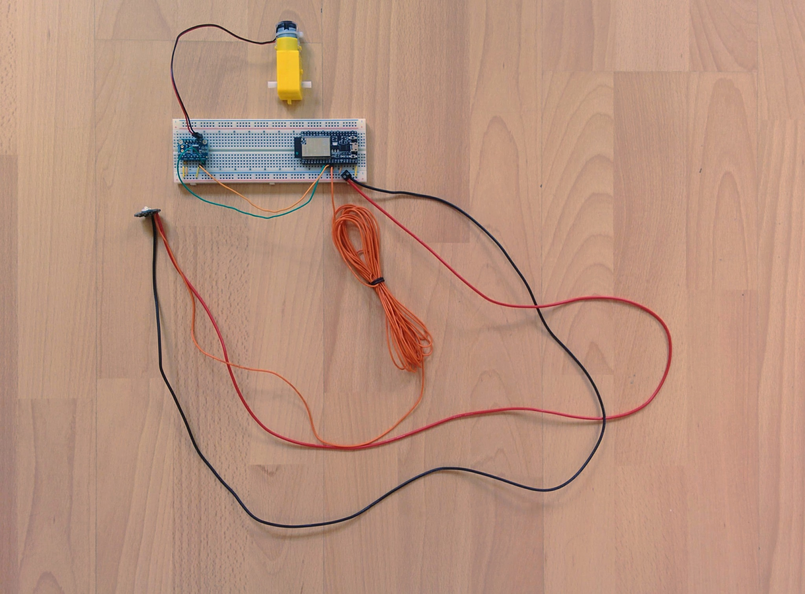

Breadboard layout closeup.  
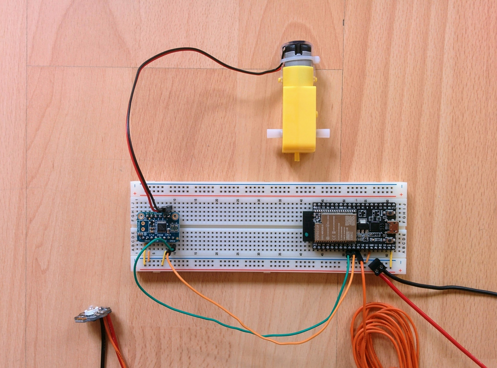

Perma-proto layout - top.  
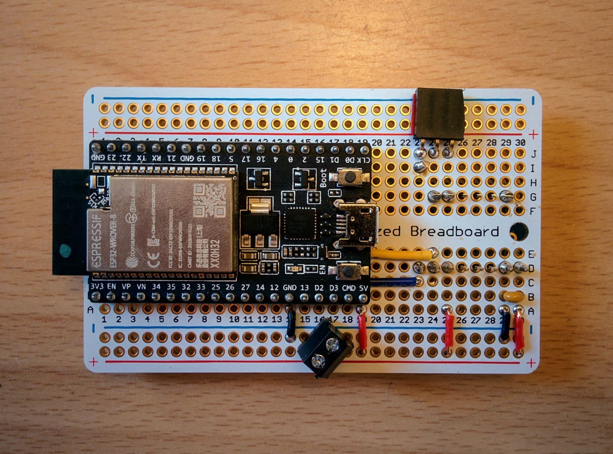

Perma-proto layout - bottom.  
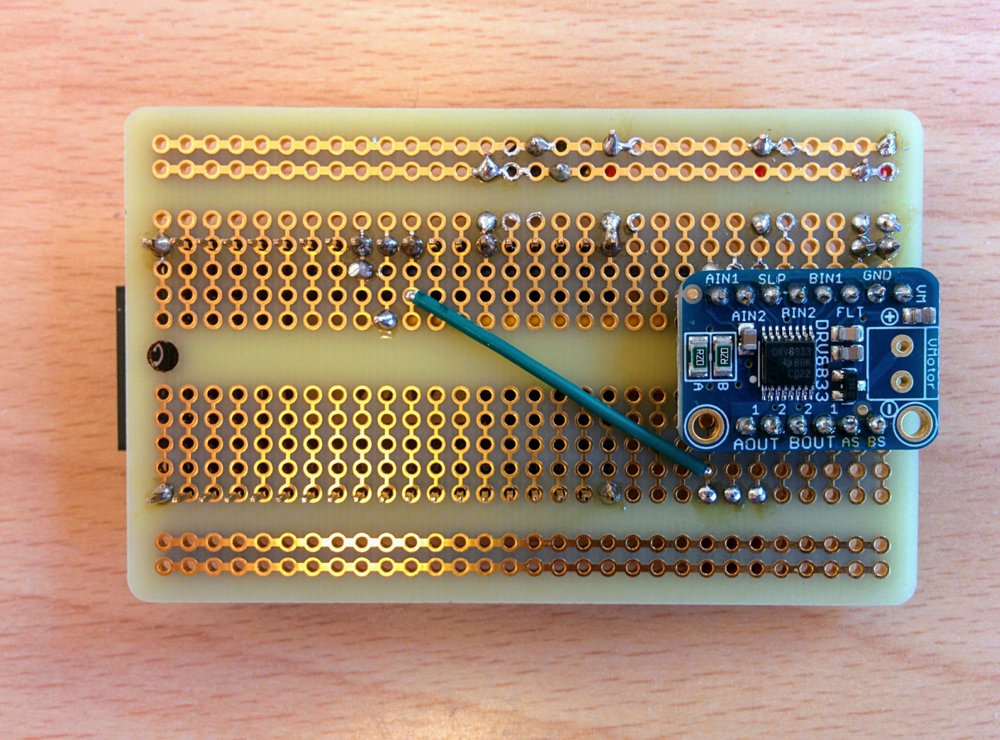  
It's not the neatest soldering job ever - the solder spread out surprisingly easily to adjacent holes and had to be tidied up.

Flat steel bar cut down to size and drilled.  
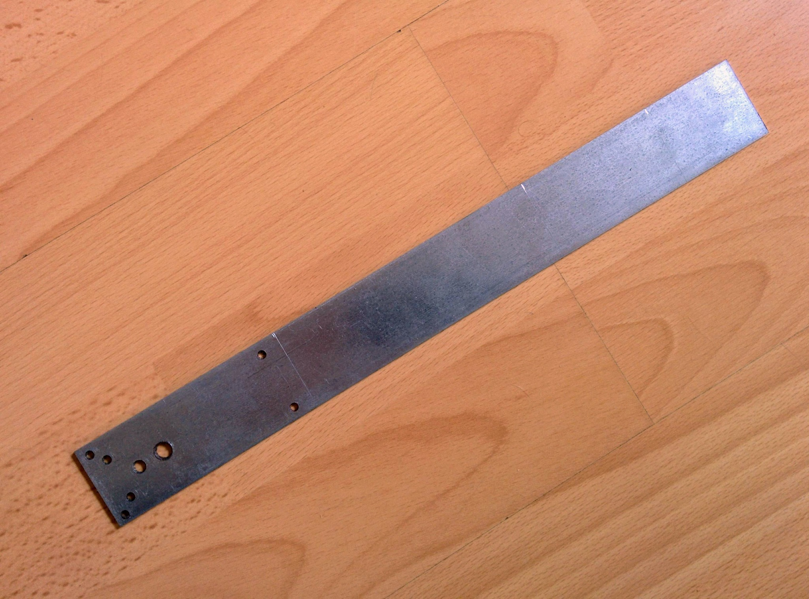  
And then bent into shape with a bending machine. This was all done at my local machine-tools center (the [Dynamo Machinenpark](https://www.dynamo.ch/maschinenpark)).

Wooden base and metal frame.  
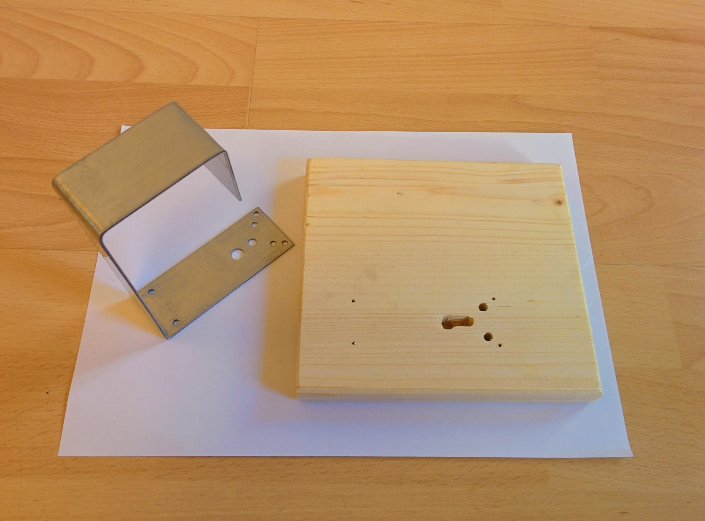  
I drilled two separate holes for the downward-facing drive shaft and the lug on the underside of the motor casing. However, the wood between the two splintered so I ended up with the elongated looking hole that you see here.

Frame attached to base.  
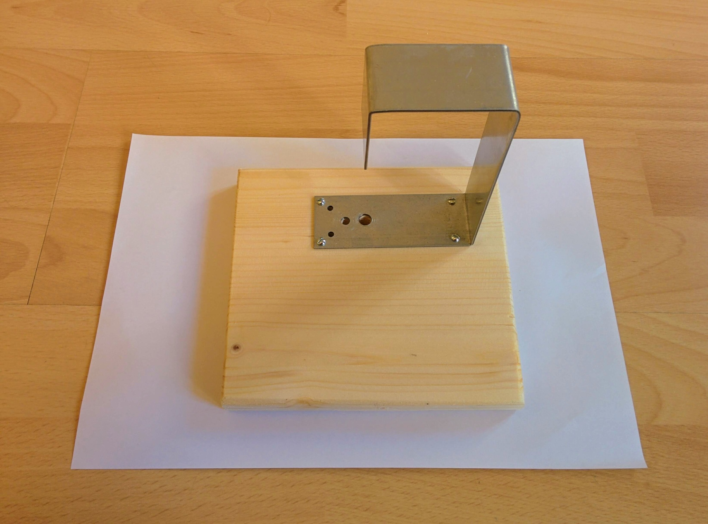

Motor and parts for the main assembly to be attached to the drive shaft.  
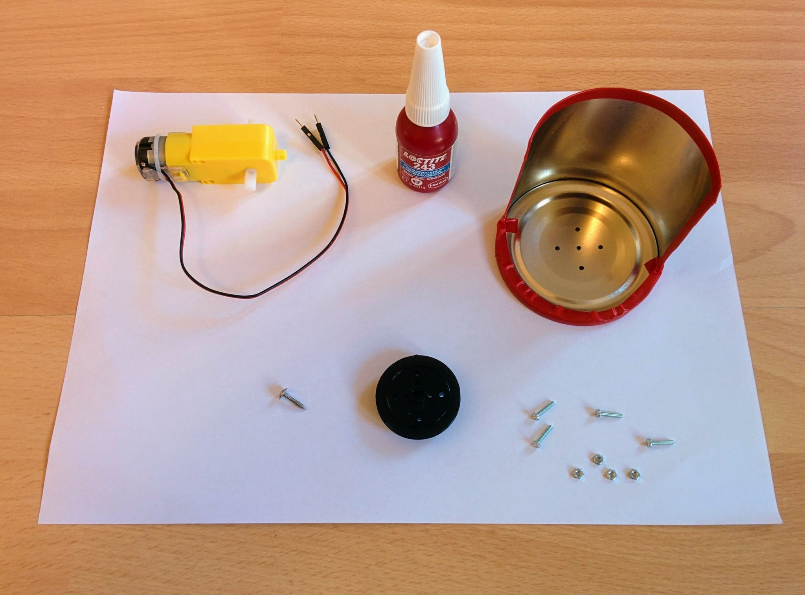

Threadlocker (blue) applied to the bolts.  
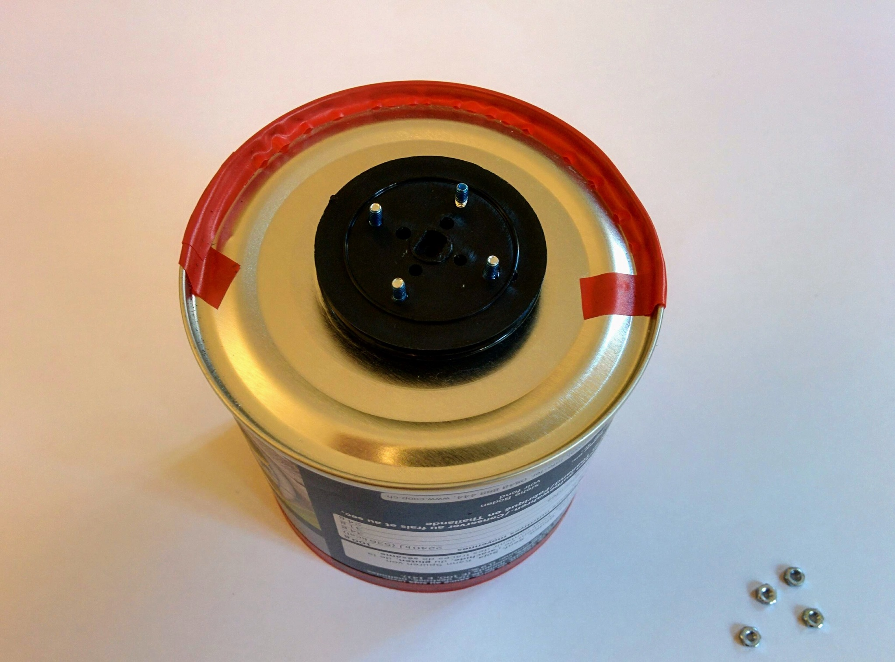  
I also used Blu Tack as filler between the plastic disk and the base of the tin.

Nuts in place.  
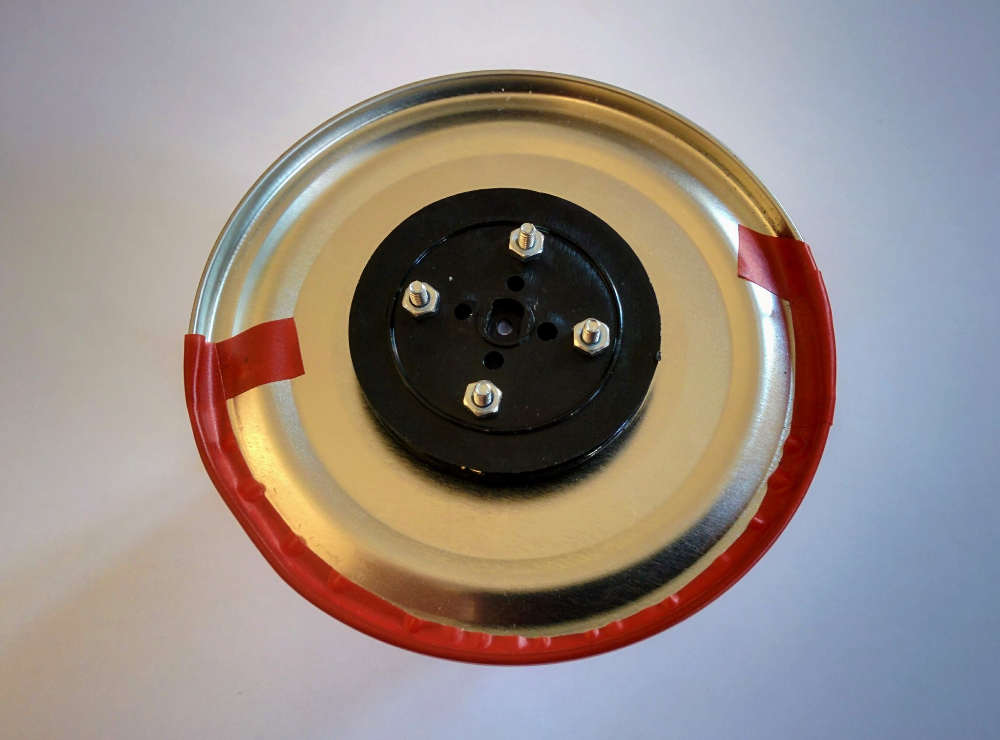

Main assembly screwed onto drive shaft.  
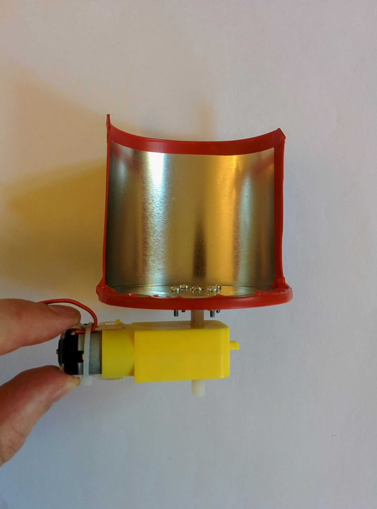

Motor bolted into place on base.  
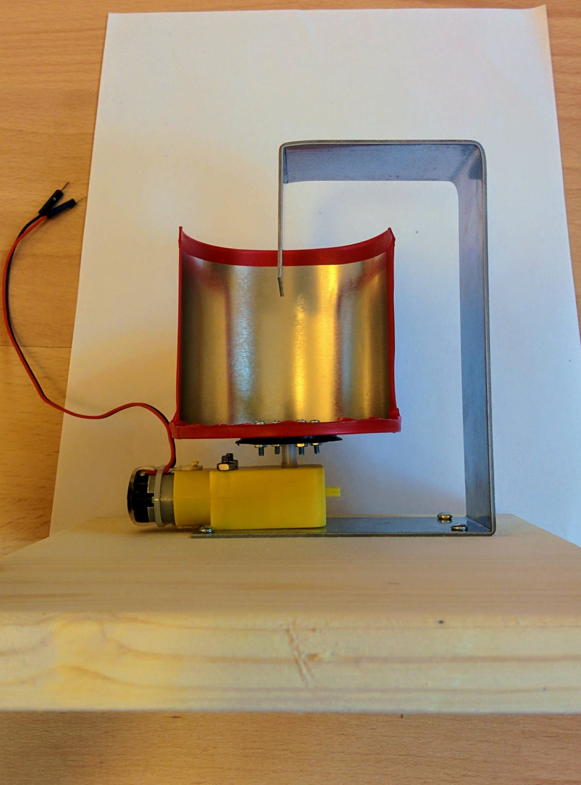

Electronics attached and ready to go.  
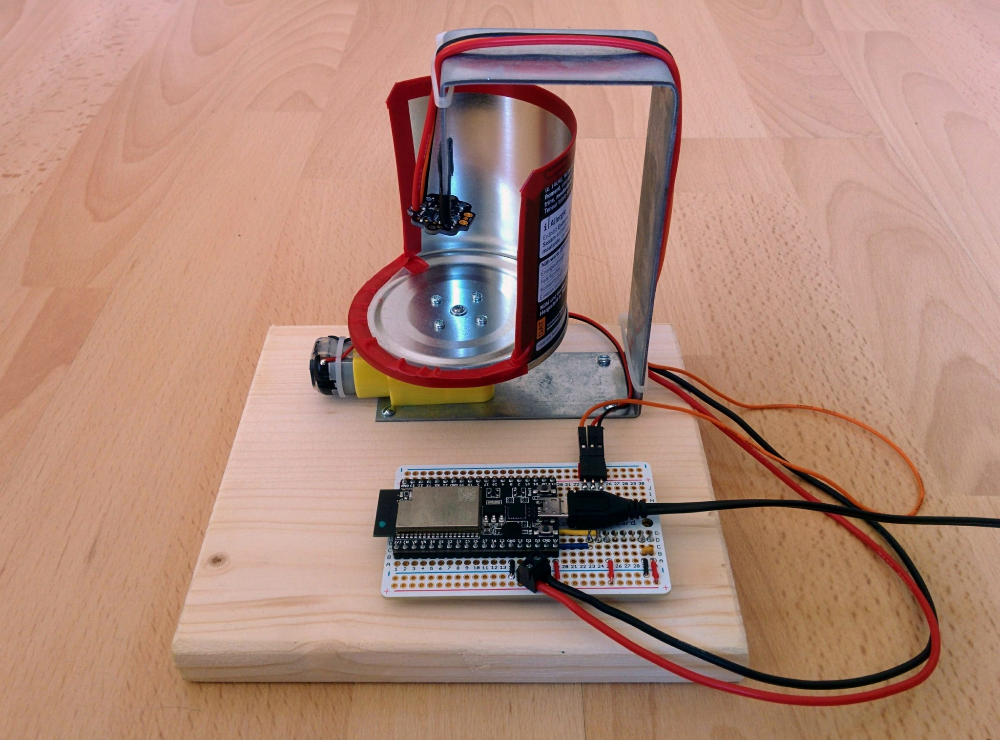
